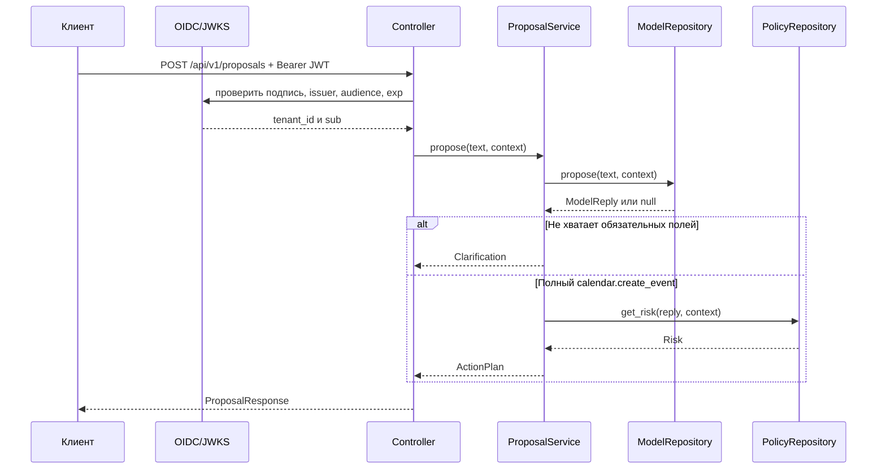

# Архитектура

## Поток запроса



## Зависимости папок

```text
controllers -> services -> repositories
      |            |
      v            v
   schemas       models

config собирает реализации; main подключает controllers.
```

Зависимости направлены от HTTP к внутренней модели. `models` не импортирует FastAPI. Сервис не
хранит состояние между запросами.

`ProposalService` разрешает только `calendar.create_event`, проверяет поля `title`, `startAt`,
`endAt` и `timeZone`, а затем формирует предложение с обязательным подтверждением. Проверка не
зависит от demo-модели, поэтому будущий AI-адаптер не меняет продуктовые правила.

Внутренняя модель `CalendarEvent` запрещает лишние поля, проверяет даты, часовой пояс, размеры строк,
уникальность участников и правило `endAt > startAt`. В `ActionPlan` попадает нормализованный payload
с внешними именами полей из репозитория `contracts`.

Ответ имеет две необязательные части:

- `proposal` — готовые точные аргументы для передачи в `action-service`;
- `clarification` — вопрос и список полей, которые нужно получить от пользователя.

Одновременно заполнена только одна часть.

## Доверенная граница

Клиент может передать только текст, язык, часовой пояс и доступные коннекторы. `tenant_id` и `user_id`
создаются из проверенных claims `tenant_id` и `sub`, поэтому поля JSON не могут подменить владельца
действия. JWT принимается только с алгоритмом `RS256`, правильными `issuer`, audience
`agent-runtime`, `exp` и `iat`.

## Внешний контракт

HTTP API следует `portable-agent/contracts` версии `2.1.0`: `text`, `timeZone`,
`availableConnectors`, `proposalId`, `requiresApproval` и `missingFields`. Копия релизной схемы
лежит в `contracts/`; contract-тест проверяет по ней настоящий запрос и ответ.
