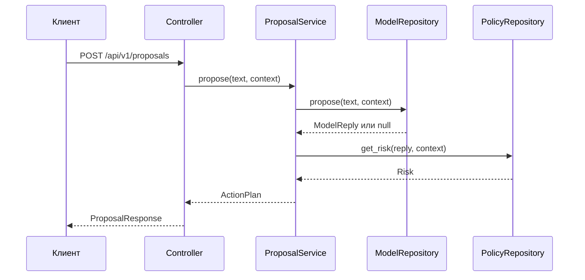

# Архитектура

## Поток запроса



## Зависимости папок

```text
controllers -> services -> repositories
      |            |
      v            v
   schemas       models

config собирает реализации; main подключает controllers.
```

Зависимости направлены от HTTP к внутренней модели. `models` не импортирует FastAPI. Сервис не
хранит состояние между запросами.

## Внешние контракты

HTTP-путь и старые имена полей (`utterance`, `actor_id`, `available_connectors`) сохранены для
совместимости с репозиторием `contracts`. Внутри используются более простые имена `text`, `user_id`
и `available_tools`; преобразование находится в HTTP-схеме.
